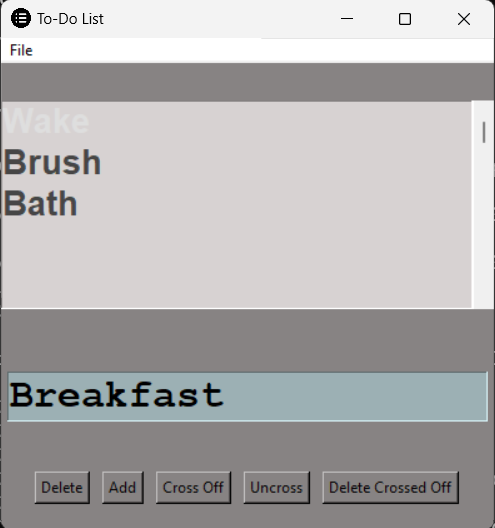
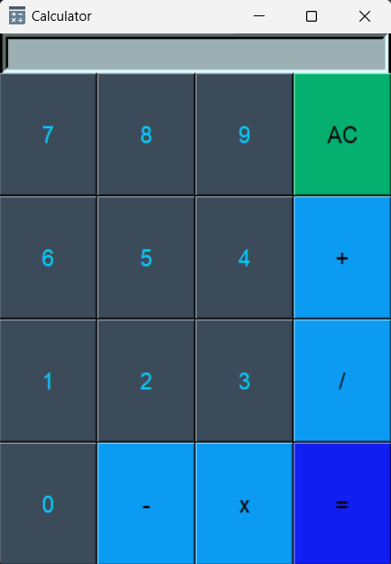

# [NeuroNexus Innovations](https://neuronexusinnovations.xyz/)
## Python Programming Internship

### Task-1: To-Do List
<pre>
1. A GUI-based Application for managing day-to-day tasks to be performed
2. Perform operations like adding, deleting, crossing and uncrossing of tasks
3. Saves a .dat file
4. Saved tasks can be imported from a .dat file from the storage
</pre>

### Task-2: Calculator
<pre>
1. A GUI-based Application for performing basic calculations
2. Includes operations like adding, subtraction, multiplication and division
3. Prompts suitable messages if performed indefinite calculations like one-divided-by-zero
</pre>

### Getting Started

**Prerequisites**
<pre>
1. Python 3.8 and above version
2. Tkinter Library
</pre>

**Installation**
<pre>
1. Download the latest version of python from [here](https://www.python.org/downloads/)
2. Try install Tkinter library by using this command in the cmd
   -> pip install tkinter
</pre>

*Know More about the Tkinter standard GUI library [here](https://docs.python.org/3/library/tkinter.html)*
